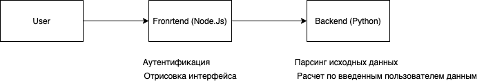

# Лидеры цифровой транспормации 2021
### Проект создан для ежегодный конкурса на соискание премий Мэра Москвы по созданию цифровых сервисов и продуктов для города

### Запуск сервиса

Запустить сервис удобнее всего локально, введя в командной строке: 

```bash
docker-compose up
```
Далее, нужно дождаться старта приложений и ввести в браузере адрес http://localhost:4200

В браузере откроется панель адмнистрирования, в центральном окне отобразится карта Москвы с "тепловыми" пометками, сообщающими о целесообразности открытия роддомов в той или иной точке. 

Помимо обработки открытых данных, сервис может рекомендовать открытие новых объектов социальной инфраструктуры на основе вводимых пользовтаелем данных. Для этого достаточно кликнуть на любое место на окрашенном участке карты и ввести новые данные по миграционному приросту, после чего нажать на кнопку "Сохранить" в этом же окне.Когда информация по всем нужным участкасм карты будет обновлена, нужно в панели администрирования нажать на кнопку "Update map", и через некоторое время карта обновится с учетом внесенных пользователем изменений.


### 1. Постановка задачи. 

Одним из наиболее интересных типов объектов для анализа размещения, на наш взгляд, являются роддома. На их примере в данном MVP мы показали наше видение рекомендательного сервиса, с помощью которого можно организовать строительство новых родильных домов на территории Москвы.

### 2. Суть сервиса.

Сервис представляет собой веб-приложение, с помощью которого на основе анализа открытых данных можно увидеть текущую ситуацию, а также получить прогноз по рекомендации на случай изменения коэффициента миграционного прироста для каждого сегмента на карте. 

### 3.  Реализация сервиса. 

Веб-приложение архитектурно распределено на frontend и backend. Frontend отвечает за авторизацию и визуальное взаимодействие с пользователем, в то время как backend решает основную задачу проекта: разработка рекомендаций по открытию новых объектов социальной инфраструктуры (в нашем частном случае - роддомов) на территории Москвы.



### 4. Развертывание сервиса

Тестовый стенд доступен в Интернете по адресу http://zusemima-app.trans-it.pro 
Работает в kebernetes и легко масштабируется
Локально запускается через docker-compose

### 5. Перспективы 

Помимо частного примера с роддомами данный проект может быть расширен рекомендациями по другим социальным объектам, - больницам, спортивным площадкам, - по мере апробации проекта и определения целесообразности. Также пользовательский интерфейс может быть доработан для более быстрого и эргономичного импорта данных, после которого можно делать прогнозы на основе динамически вводимых данных

